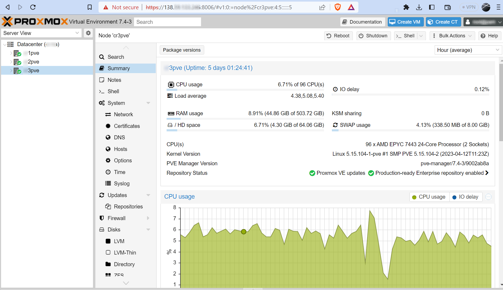
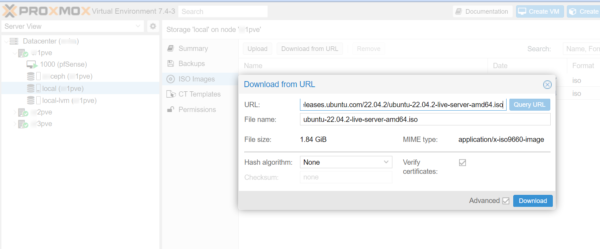
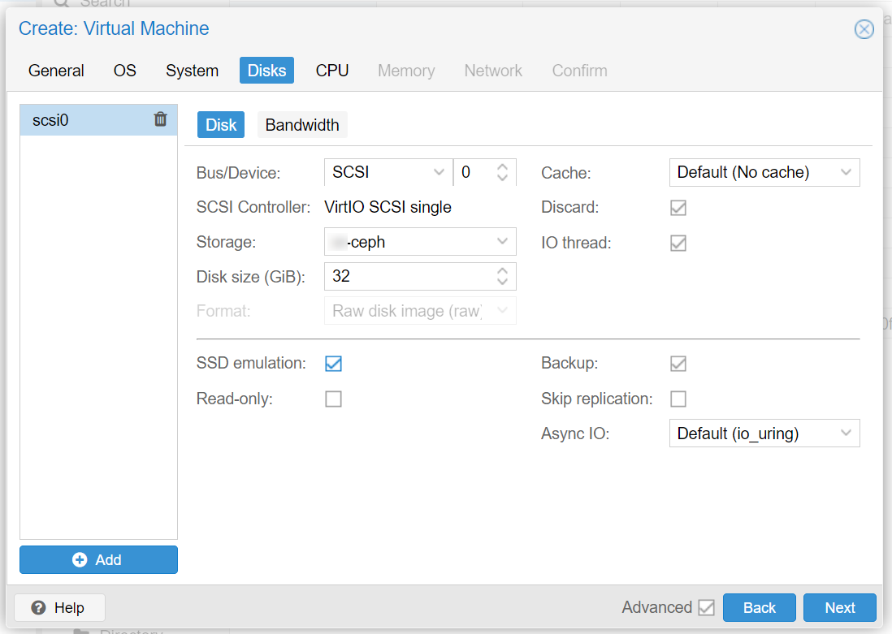

# Proxmox

Proxmox VE is a open-source server management platform for enterprise virtualization.

It integrates the KVM hypervisor and Linux Containers (LXC), software-defined storage and networking functionality, on a single platform.

With the integrated web-based user interface you can manage VMs and containers, high availability for clusters, or the integrated disaster recovery tools with relative ease.

## Download Proxmox

Download the ISO image of proxmox [here](https://www.proxmox.com/en/downloads/category/iso-images-pve)

In case you don’t have access to virtual media via IPMI, then the ISO image must be loaded into an USB drive with a tool like USBimager [here](https://gitlab.com/bztsrc/usbimager). 

## Install Proxmox

Insert the USB, power on your rig and follow the on-screen instructions to install Proxmox.

Be specially carefull when entering the timezone and networking information.

After installation and restart, you will be presented with a log-in screen showing:


Now you can open your preferred Internet browser and navigate to the url shown in the prompt above, this should open the Graphical User Interface (GUI) of Proxmox



Now you are ready on your way to download Operating System (OS) images and create your first Virtual Machine (VM)

## Download `iso` images

Before spinning any virtual machines in Proxmox, you will need to download the relevant `iso` images of the operating systems you want to use in said VMs.

In the particular case of Ubuntu Server, this procedure is very simple, just go to the [download page](https://ubuntu.com/download/server):


And click on the big green `Download Ubuntu Server` button to proceed to the download screen.

Now a pop-up window will appear on your screen, feel free to dismiss it because you don't actually want to download this file to your PC (you just need the link).

Once dismissed, you can right-click on the `download now` link and select `Copy link address` from the drop-down contextual menu:


Back in Proxmox's GUI, look for the `local` storage of your server in the explorer panel at the left of the screen, then select `ISO Images` in the list of local available items in the centre of the screen and lastly click on the `Download from URL` link



Once you paste the `URL` of the image in the first field of the pop-up window, click the blue `Query URL` button to automatically populate the rest of the form and finish with a click of the `Download` button.

The file should download in a few seconds / minutes, depending on your connection speed.

## First VM

:::info

Before provisioning your first machine, you may want to install Proxmox in the rest of your physical servers an interconnect them in a High Availability cluster, as shown in the relevant [guide](/docs/6-members/7-highavailability/1-proxmoxceph.md)

:::

:::caution

Before the creation of your first machine, please make sure that you have provisioned the appropriate storage type to the Proxmox environment, that is, for example, an local LVM device for a stand-alone server, or a Ceph pool for a High Availability cluster, please note that migrating between the these is a non-trivial and error-prone maneouvre.

:::


In the Proxmox GUI, make click on the blue `Create VM` button and a wizard will guide you through the process:





## Remove 'cloud-init'

Unless you are using OpenStack, AWS, or similar services, then `cloud-init` may actually be slowing down the booting of your VM and eventually halt it from booting if it does not have a proper working IP.

This is how to disable cloud-init in Ubuntu (source [here](https://gist.github.com/zoilomora/f862f76335f5f53644a1b8e55fe98320))

```shell
# Create an empty file to prevent the service from starting
sudo touch /etc/cloud/cloud-init.disabled
# Disable all services (uncheck everything except "None"):
sudo dpkg-reconfigure cloud-init
# Uninstall the package and delete the folders
sudo apt purge cloud-init
sudo rm -rf /etc/cloud/ && sudo rm -rf /var/lib/cloud/
```

Check that Emulator Agent is installed by installing it and reboot the system:

```shell
sudo apt install qemu-guest-agent
sudo reboot
```

## Preconfigure VM

You may want to perform some minor configuration in your freshly deployed VM by following the instruction in this [section](/docs/6-members/4-machines/1-ubuntu.md).

Once you are happy with the basic accessibilty and security of the virtual machine, you can then proceed to convert it in a template for future and recursive use in deploying additional machines of the same basic characteristics.

:::danger

Converting a VM to Template in Proxmox is a one-way street, you will not be able to go back and make changes. The recommendation in this case is:
1- Make a copy (clone) of this VM,
2- Convert the clone to Template
3- Thus you can keep the original VM deactivated but available in case you want to update it, clone it and convert to a new template.

:::

## Convert VM to Template

Remove ssh keys

```shell
sudo rm /etc/ssh/ssh_host_*
```

Empty the machine id file:

```shell
sudo truncate -s 0 /etc/machine-id
cat /etc/machine-id
```

Check or create the symlink to the machine id file

```shell
sudo rm /var/lib/dbus/machine-id
sudo ln -s /etc/machine-id /var/lib/dbus/machine-id
ll /var/lib/dbus/machine-id
```

Delete the command history

```shell
sudo rm .bash_history
```

## Cloning from Template

After spawning, 

```shell
sudo nano /etc/hostname
sudo nano /etc/hosts
sudo dpkg-reconfigure openssh-server
sudo systemctl restart ssh
```

If increasing the disk size

```shell
sudo fdisk -l
sudo parted /dev/sda
(parted) print-> Fix
(parted) resizepart 2 100% -> Yes
(parted) quit
sudo resize2fs /dev/sda2
```