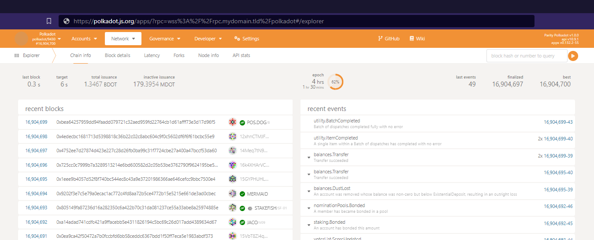
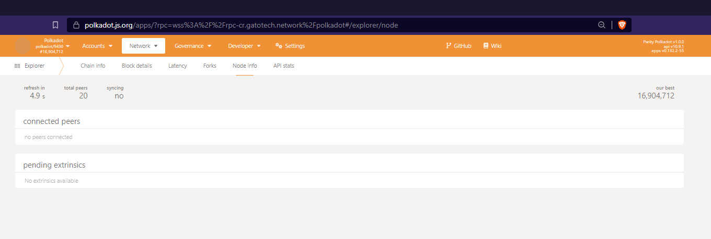

# Archive Nodes

An Archive node stores all past blocks of the relevant blockchain, with complete state available for every block.

The main purpose of Archive nodes is to be used by utilities, such as block explorers, wallets, discussion forums, etc. which need access to historical information.

These application often connect amd consult the archive nodes via RPC endpoints and WebSocket connections.

To provide archive services under the Infrastructure Builders' Programme, you will need to cater for the following use cases:

1. http / https requests.
2. ws / wss sessions.

These will be possible by deploying the following solution per required chain:


In the diagram above, a HAProxy instance will listen to the URL of the RPC service and will connect all the incoming requests to at least two different archive nodes in the backend, this configuration is meant to provide resiliency, throughput and maintainability to the services of the Infrastructure Builders' Programme.

## Configure Archive Service

The configuration of the substrate node (i.e. Polkadot, Kusama, etc) can be adjusted in the systemd service file:

```shell
sudo nano /etc/systemd/system/polkadot1.service
```

and the recommended binary flags are shown as follows:

```systemd title="/etc/systemd/system/polkadot1.service"
[Unit]
Description=Polkadot Node
After=network-online.target
Wants=network-online.target

[Service]
User=polkadot
Group=polkadot
ExecStart=/usr/local/bin/polkadot \
  --name MY_ARCHIVE_NODE_01 \
  --chain polkadot \
  --base-path '/var/lib/polkadot/polkadot1' \
  --state-pruning archive \
  --block-pruning archive \
  --log sync=warn,afg=warn,babe=warn \
  --listen-addr /ip6/::/tcp/30333 \
  --listen-addr /ip6/::/tcp/30334/ws \
  --listen-addr /ip4/0.0.0.0/tcp/30333 \
  --listen-addr /ip4/0.0.0.0/tcp/30334/ws \
  --public-addr /dns/rpc.mydomain.tld/tcp/30333 \
  --public-addr /dns/rpc.mydomain.tld/tcp/30334/ws \
  --wasm-execution Compiled \
  --execution native-else-wasm \
  --no-hardware-benchmarks \
  --max-runtime-instances 256 \
  --runtime-cache-size 64 \
  --rpc-external \
  --prometheus-external \
  --rpc-methods safe \
  --rpc-cors all

Restart=always
RestartSec=120

[Install]
WantedBy=multi-user.target
```

Note that this service file makes use of the following flags:

- `--state-pruning` and `--block-pruning` must both be set to *`archive`* for the node to be able so store the whole blockchain and serve historical information right from the genesis block.
- `--listen-addr`: to open the relevant p2p ports in the node, here we have created four instances: both IPv4 & IPv6 and both vanilla http & websocket endpoints. 
- `--public-addr`: these are the addresses that the node will advertise to the network, note that they are not indicated in terms of IPv6 or IPv4 but in DNS addresses instead.
- `--max-runtime-instances` set to `256` and `--runtime-cache-size` set to `64` will prevent the *`Ran out of free WASM instances`* error message occurring under load in the Polkadot and Kusama networks.
- The rest of the flags are there for convenience and performance.

## Configure HAProxy Service

If not already installed, please follow the following commands to install the latest version of HAProxy 

```shell
# Install dependencies
sudo apt install software-properties-common

# Add the repository of the haproxy project
sudo add-apt-repository ppa:vbernat/haproxy-2.7

# Update the database of available packages
sudo apt update

# install haproxy
sudo apt install haproxy

# verify the installation
sudo haproxy -v
```

If HAProxy was correctly installed, the output will be similar to this one:

```
HAProxy version 2.7.0-1ppa1~focal 2021/11/26 - https://haproxy.org/
Status: stable branch - will stop receiving fixes around Q3 2023.
Known bugs: http://www.haproxy.org/bugs/bugs-2.7.0.html
Running on: Linux 5.4.0-91-generic #102-Ubuntu SMP Fri Nov 5 16:31:28 UTC 2023 x86_64
```

By default, HAProxy is not configured to listen on any ports. In this step, since we are going to configure it as a reverse proxy, we are going to make changes to the default HAProxy configuration. 

```shell
# Make a copy of the current configuration for backup
sudo cp -a /etc/haproxy/haproxy.cfg{,.bak}

# Edit the configuration file
sudo nano /etc/haproxy/haproxy.cfg
```

Add the following content to this file, but make sure to use the appropriate user, group, and details for your archive nodes:

```conf title="/etc/haproxy/haproxy.cfg"
global
   log 127.0.0.1 local0
   chroot /var/lib/haproxy
   pidfile /var/run/haproxy.pid
   maxconn 250000
   user  haproxy
   group haproxy
   daemon
   nbthread 8
   server-state-base /opt/haproxy-2.6.6/etc/state/
   tune.bufsize 131072
   tune.ssl.default-dh-param 4096
   stats socket /var/run/haproxy.sock mode 600 level admin
   stats timeout 2m
   maxcompcpuusage 50

defaults
   log global
   retries 3
   # option http-use-htx
   maxconn 250000
   timeout connect 5s
   timeout client 300s
   timeout server 300s
   timeout queue 25s

####
#
# RELAYCHAIN CONFIGURATIONS
#
####
# Polkadot WSS configuration (for rpc nodes)

frontend relaychains-frontend
   bind *:443 ssl crt /etc/pki/certs
   mode http
   timeout client 300s

   # Web sockets
   acl wss hdr(Upgrade) -i websocket 

   # Relay chains
   acl polkadot path_beg -i /polkadot
   acl kusama path_beg -i /kusama
   acl westend path_beg -i /westend
   acl westmint path_beg -i /westmint
   acl statemine path_beg -i /statemine
   acl statemint path_beg -i /statemint

   # WSS Paths
   use_backend polkadot-wss-backend if polkadot wss
   use_backend kusama-wss-backend if kusama wss
   use_backend westend-wss-backend if westend wss
   use_backend westmint-wss-backend if westmint wss
   use_backend statemine-wss-backend if statemine wss
   use_backend statemint-wss-backend if statemint wss

   # RPC Paths
   use_backend polkadot-rpc-backend if polkadot !wss
   use_backend kusama-rpc-backend if kusama !wss
   use_backend westend-rpc-backend if westend !wss
   use_backend westmint-rpc-backend if westmint !wss
   use_backend statemine-rpc-backend if statemine !wss
   use_backend statemint-rpc-backend if statemint !wss


backend polkadot-rpc-backend
   mode http
   balance leastconn
   server polkadot-rpc-1 10.50.50.110:10000 check inter 2s maxconn 40
   server polkadot-rpc-2 10.50.50.111:11000 check inter 2s maxconn 40
   server polkadot-rpc-3 10.50.50.112:12000 check inter 2s maxconn 40
   server polkadot-rpc-4 10.50.50.113:13000 check inter 2s maxconn 40

backend polkadot-wss-backend
   mode http
   balance leastconn
   server polkadot-rpc-1 10.50.50.110:10001 check inter 2s maxconn 40
   server polkadot-rpc-2 10.50.50.111:11001 check inter 2s maxconn 40
   server polkadot-rpc-3 10.50.50.112:12001 check inter 2s maxconn 40
   server polkadot-rpc-4 10.50.50.113:13001 check inter 2s maxconn 40

backend kusama-rpc-backend
   mode http
   balance leastconn
   server kusama-rpc-1 10.50.50.120:10000 check inter 2s maxconn 40
   server kusama-rpc-2 10.50.50.121:11000 check inter 2s maxconn 40
   server kusama-rpc-3 10.50.50.122:12000 check inter 2s maxconn 40
   server kusama-rpc-4 10.50.50.123:13000 check inter 2s maxconn 40

backend kusama-wss-backend
   mode http
   balance leastconn
   server kusama-rpc-1 10.50.50.120:10001 check inter 2s maxconn 40
   server kusama-rpc-2 10.50.50.121:11001 check inter 2s maxconn 40
   server kusama-rpc-3 10.50.50.122:12001 check inter 2s maxconn 40
   server kusama-rpc-4 10.50.50.123:13001 check inter 2s maxconn 40

backend westend-rpc-backend
   mode http
   balance leastconn
   server westend-rpc-1 10.50.50.130:10000 check inter 2s maxconn 40
   server westend-rpc-2 10.50.50.131:11000 check inter 2s maxconn 40

backend westend-wss-backend
   mode http
   balance leastconn
   server westend-rpc-1 10.50.50.130:10001 check inter 2s maxconn 40
   server westend-rpc-2 10.50.50.131:11001 check inter 2s maxconn 40

backend westmint-rpc-backend
   mode http
   balance leastconn
   server westmint-rpc-1 10.50.50.140:10000 check inter 2s maxconn 40

backend westmint-wss-backend
   mode http
   balance leastconn
   server westmint-rpc-1 10.50.50.140:10001 check inter 2s maxconn 40

backend statemine-rpc-backend
   mode http
   balance leastconn
   server statemine-rpc-1 10.50.50.150:10000 check inter 2s maxconn 40

backend statemine-wss-backend
   mode http
   balance leastconn
   server statemine-rpc-1 10.50.50.150:10001 check inter 2s maxconn 40

backend statemint-rpc-backend
   mode http
   balance leastconn
   server statemint-rpc-1 10.50.50.160:10000 check inter 2s maxconn 40

backend statemint-wss-backend
   mode http
   balance leastconn
   server statemint-rpc-1 10.50.50.160:10001 check inter 2s maxconn 40

####
# END RELAYCHAIN CONFIGURATIONS
####
```
Now the setup is ready for:
## Restart the Services

Apply the following commands in the shell to start the services.

```shell
# Restart the reverse proxy service
sudo systemctl restart haproxy

# Clear any previous blockchain database, if needed
sudo rm -r /var/lib/polkadot/*

# Restart the bootnode service
sudo systemctl restart polkadot1
```

:::warn
Before removing the old database, be warned that the full syncing of the main relay chains (i.e. Polkadot and Kusama) are taking between 2 to 4 weeks depending on node performance and peer availability.
:::

## Test your Endpoints

Given that your services must cater for both https and websocket users, below is the procedure to test them accordingly

```shell
# Request the following Remote Procedure Call (RPC) to the https endpoint of your node
curl -H "Content-Type: application/json" -d '{"id":1, "jsonrpc":"2.0", "method": "system_health", "params":[]}' https://rpc.mydomain.tld/polkadot
```

If everything went well, that command should return a response message similar to the one below.

```
{"jsonrpc":"2.0","result":{"peers":20,"isSyncing":false,"shouldHavePeers":true},"id":1}
```

To test the websocket endpoint, the easiest way is to add it to the polkadot.{js} interface and check that the app is connecting to the appropriate chain:

1. Head up to your preferred browser and navigate to https://polkadot.js.org/apps, you will be presented with the initial interface:


1. In the top left corner, click to change the default chain/endpoint connected, this will display a menu showing the options, go to the bottom `DEVELOPMENT` field and enter your endpoint (e.g. wss://rpc.mydomain.tld/polkadot):


3. The new connection will be attempted and, if successful, you will see the updated app showing blockchain information being populated:



4. To obtain a similar information to what was received from the https endpoint, the wss equivalent is shown in the page `Network` -> `Explorer` -> `Node info`:



And finally:

## Announce your Services

Let the administrators of the GeoDNS and Anycast services know when your endpoints are up and running so they can add you to the rotation set.

.-