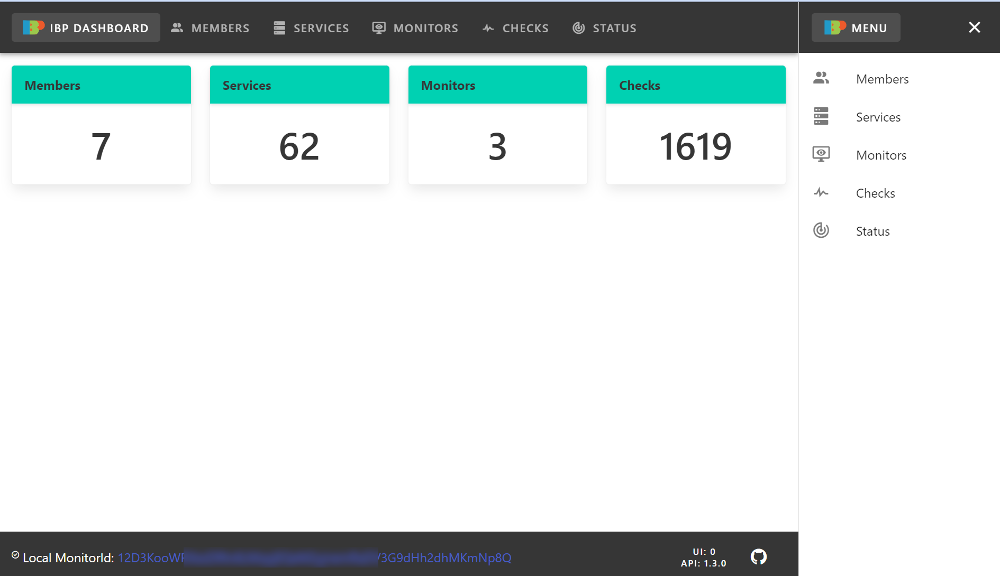

# Monitor

Each member of the Infrastructure Builders' Programme, whether in the hobbyist or in the professional tracks, must run a node as part of the monitoring network that will measure the serive levels of the programme.

The code of this monitor solution is open source and can be found in this Github repository: [ibp-monitoring](https://github.com/ibp-network/ibp-monitor).

## Prerequisites:

Before continuing with the procedures below, you must first:

1. Provision a virtual machine or cloud instance with the provider of your choice, this machine must be accessible from the Internet.
2. (optional) Arrange a DNS record in your own domain name (e.g. `ibp-monitor.example.com`) pointing to the IP of your machine above.
3. Install `docker` as shown below:

``` shell
# Remove any old docker installation
for pkg in docker.io docker-doc docker-compose podman-docker containerd runc; do sudo apt-get remove $pkg; done

# Install dependencies
sudo apt update
sudo apt install ca-certificates curl gnupg

# Install docker's official GPG keys
sudo install -m 0755 -d /etc/apt/keyrings
curl -fsSL https://download.docker.com/linux/ubuntu/gpg | sudo gpg --dearmor -o /etc/apt/keyrings/docker.gpg
sudo chmod a+r /etc/apt/keyrings/docker.gpg

# Set up the repository
echo \
  "deb [arch="$(dpkg --print-architecture)" signed-by=/etc/apt/keyrings/docker.gpg] https://download.docker.com/linux/ubuntu \
  "$(. /etc/os-release && echo "$VERSION_CODENAME")" stable" | \
  sudo tee /etc/apt/sources.list.d/docker.list > /dev/null

# Refresh the database
sudo apt update

# Install docker and tools
sudo apt-get install docker-ce docker-ce-cli containerd.io docker-buildx-plugin docker-compose-plugin

# (optional) Test the installation
sudo docker run hello-world
```

## Preparing the deployment

Now you are going to download the code of the monitor directly from the IBP's github page

``` shell
# Clone the repository in the machine
git clone https://github.com/ibp-network/ibp-monitor.git

# Enter the directory
cd ibp-monitor

# Select the latest stable version
git checkout 0.1.0
```

<!--- The following configuration seems unnecessary for docker deployment (TBC):

``` shell
cp .env.sample .env
nano .env
```

``` conf
# public DNS address of the host - comment out if not used
P2P_PUBLIC_HOST=ibp-monitor.test.org
# public IPv4 or IPv6 address of the host - comment out if not used
P2P_PUBLIC_IP=111.111.111.111
```

``` shell
cd config
cp config.js config.local.js
nano config.local.js
```

``` js
// (...)

const config = {
  dateTimeFormat: 'DD/MM/YYYY HH:mm',
  sequelize: {
    database: 'ibp_monitor',
    username: 'ibp_monitor',
    password: 'ibp_monitor',
    options: {
      dialect: 'mariadb',
      // hostname = docker service name
      host: 'ibp-datastore',
      port: 3306,
      logging: false,
    },
  },

// (...)

```

Ok.. this is the end of the comment... continuing the document now
--->

Let's configure now some variables needed for the deployment

``` shell
cd ../docker
cp .env.sample .env
nano .env
```

The file's default content looks like this, please amend appropriately

``` conf
# public DNS address of the host - comment out if not used
P2P_PUBLIC_HOST=ibp-monitor.example.com
# public IPv4 or IPv6 address of the host - comment out if not used
P2P_PUBLIC_IP=111.111.111.111
# public port for peer-to-peer connections
P2P_PUBLIC_PORT=30000
# ui http port
HTTP_PORT=30001
# api http port
API_PORT=30002
```

Finally, you can start the monitoring services with:

``` shell
docker compose up -d
```

And if you connect your browser to the port indicated in `HTTP_PORT` you will see the frontend of the monitor running:


